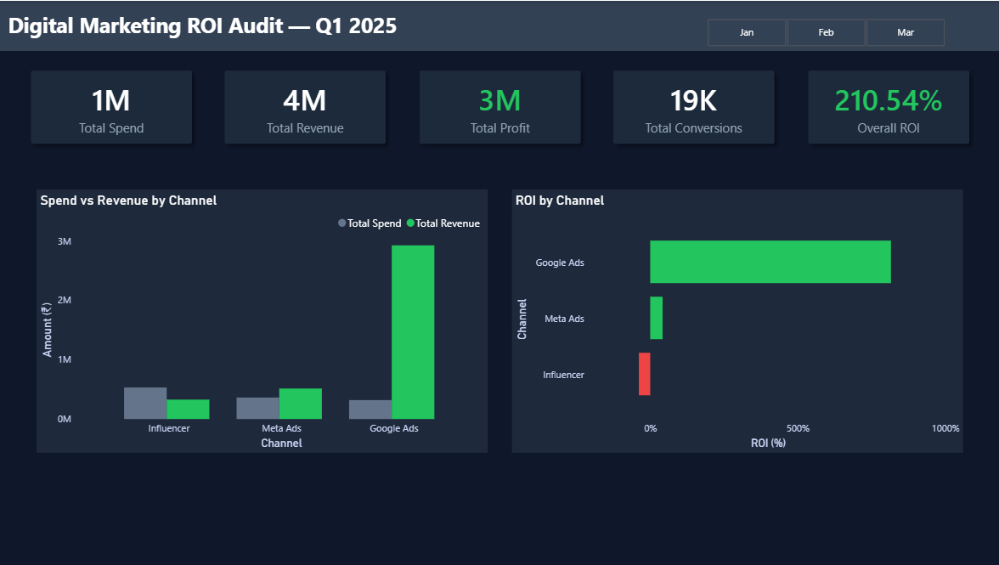
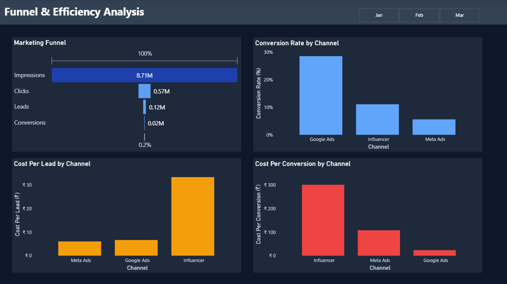

# 📊 Digital Marketing ROI Analysis

## 🚀 Project Overview

This project analyzes digital marketing performance across multiple channels (Google Ads, Meta Ads, Influencer Marketing) to identify budget inefficiencies and optimize return on investment (ROI).

---

## 🎯 Problem Statement

The company is investing heavily in multiple marketing channels, but overall profitability is inconsistent.
The goal is to identify:

* Which channels are profitable
* Where budget is being wasted
* How to optimize spend for maximum ROI

---

## 📂 Dataset

The dataset contains campaign-level data including:

* Spend
* Impressions
* Clicks
* Leads
* Conversions
* Revenue
* Date (Month-wise analysis)

---

## 🧮 Key Metrics Used

* CTR (Click Through Rate)
* Lead Conversion Rate
* Conversion Rate
* Cost Per Lead (CPL)
* Cost Per Conversion (CPC)
* ROI (Return on Investment)
* ROAS (Return on Ad Spend)
* Profit

---

## 📊 Dashboard Pages

### 🔹 1. Executive Summary

* Overall KPIs (Spend, Revenue, Profit, ROI,conversions)
* Channel-wise performance comparison
* Identifies high and low performing channels

### 🔹 2. Funnel & Efficiency Analysis

* Marketing funnel (Impressions → Clicks → Leads → Conversions)
* Conversion rate comparison across channels
* Cost efficiency (CPL & CPC)

### 🔹 3. Trend & Budget Optimization

* Monthly spend vs revenue trends
* ROI trends by channel
* Business recommendations for budget reallocation

---

## 🔍 Key Insights

* Influencer marketing shows negative ROI (~ -40%) and highest cost per conversion
* Google Ads delivers the highest ROI and most efficient conversions
* Meta Ads generates low-cost leads but suffers from poor conversion rates
* Marketing activity drops significantly in March, indicating potential campaign pause

---

## 💡 Recommendations

* Reduce spend on Influencer marketing
* Increase budget allocation to Google Ads
* Improve conversion strategy for Meta Ads
* Reallocate 30–40% budget to high-performing channels

---

## 🛠 Tools Used

* Microsoft Excel (Data Cleaning & KPI Calculation)
* Power BI (Dashboard & Visualization)

---

## 📸 Dashboard Preview

### Executive Summary

### Funnel & Efficiency Analysis

### Trend & Optimization

---

## 👨‍💻 Author

Durga Sairam
